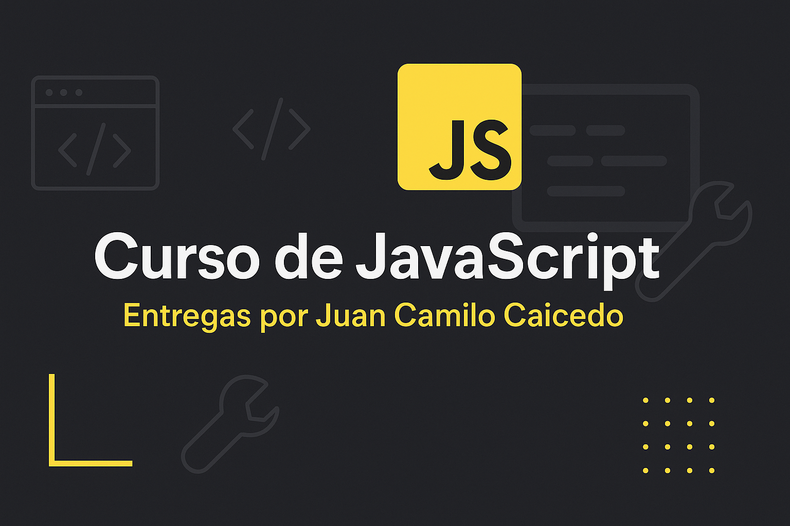

# 📦 Entregas del Curso de JavaScript

Este repositorio contiene las entregas, ejercicios y proyectos realizados durante mi proceso de aprendizaje en el **Curso de JavaScript**.  
Cada entrega refleja la aplicación práctica de los conceptos vistos, desde lo más básico hasta desafíos con lógica más compleja.

---

## 🚀 Contenido

### ✅ Fundamentos de JavaScript
- Variables, tipos de datos, operadores
- Condicionales (`if`, `else`, `switch`)
- Bucles (`for`, `while`)
- Funciones y arrays

### 🧩 Proyectos
- 🛒 Simulación de una cafetería (menú, carrito, confirmación de pedido)

---

## 📂 Estructura del repositorio

Curso-de-JavaScrip/
├── primer-entrega/
│   ├── index.html 
│   ├── script.js 
│   ├── portada.png 
│   └── README.md  
|               
└── .gitignore   

---

## 💻 Tecnologías utilizadas

- JavaScript (Vanilla JS)
- Consola del navegador / Node.js
- Git y GitHub para control de versiones

---

## 👨‍💻 Autor

**Juan Camilo Caicedo**  
Estudiante de Desarrollo Web | Tecnologo en Mecatrónica  
📍 Colombia  
🚀 Apasionado por automatización, programación y tecnología

---

## 📌 Nota

Este repositorio se actualizará constantemente con nuevas entregas y mejoras a medida que avance el curso.

